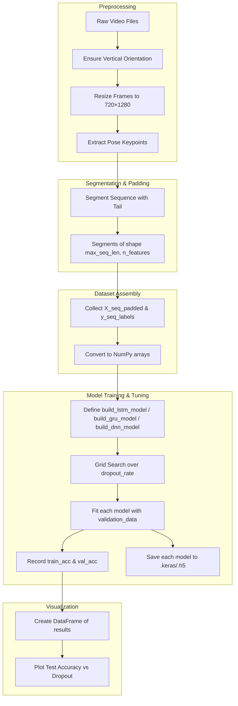
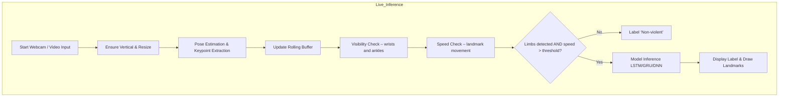

mediapipe: For extracting pose and hand landmarks.

pandas: For data manipulation and analysis.

opencv-python-headless: For image and video processing without GUI support.

tensorflow: For building and training neural networks, including LSTMs.

scikit-learn: For additional machine learning utilities.

numpy: For numerical computations.

matplotlib: For data visualization.

```txt
Each frame has 33 landmarks (MediaPipe Pose detects 33 distinct body keypoints). For each landmark, you get 4 values:

    x (normalized horizontal coordinate)

    y (normalized vertical coordinate)

    z (relative depth)

    visibility (confidence of that landmark being visible)

So for each frame:

    33 landmarks × 4 values each = 132 features total.
```

### Main Dataset
[Single_person_violent](https://www.kaggle.com/datasets/anuja2188/single-person-violent-activity)

[A-Dataset-for-Automatic-Violence-Detection-in-Videos](https://github.com/airtlab/A-Dataset-for-Automatic-Violence-Detection-in-Videos/tree/master?tab=readme-ov-file#a-dataset-for-automatic-violence-detection-in-videos)


### Training Data Directory Structure
**Original Data**
```txt
Single_person_violent/
├── Kick
│   ├── kicking1.mp4
│   ├── kicking2.mp4
│   └── ...
├── Punching
│   ├── punching1.mp4
│   ├── punching2.mp4
│   └── ...
└── Standing
    ├── standing1.mp4
    ├── standing2.mp4
    └── ...
```

**Extracted Frames for Pose Estimation and Trainning**
```txt
frames/
├── Kick
│   └── kicking1
│       ├── frame_0.jpg
│       ├── frame_5.jpg
│       ...
├── Punching
│   └── punching1
│       ├── frame_0.jpg
│       ├── frame_5.jpg
│       ...
└── Non-violent
    └── non1
        ├── frame_0.jpg
        ├── frame_5.jpg
        ...
```




